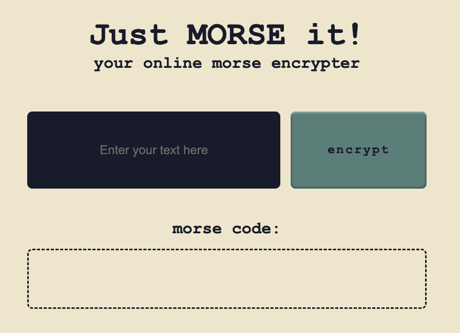
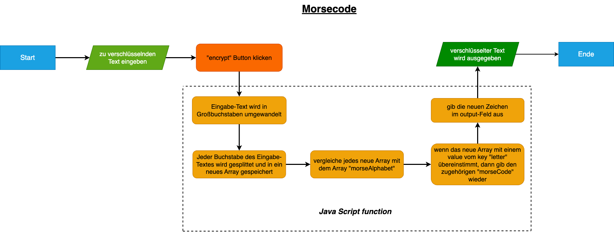

# .---..-...-/-----.-...../..-

# Just MORSE it!

A simple yet fun online tool for encrypting-fans.

Simply enter a text of your choice in the input field and press "encrypt". Watch how your letters magicly turn into dots and dashes.

## Try it: 🫵

💻 https://moniqueheusinger.github.io/Morsecode/

---

This project was created as part of a coding bootcamp (fullstack development) at SuperCode GmbH.

## Screenshots 📸

## Flow Chart 📐✏️

## Allowed Characters 🔤

- a-z or A-Z
- German "Umlaute": Ä, Ö, Ü as well as ß
- Numbers
- special characters: . ,

## Roadmap 🔜

**Fix bug:**

- extend the input field when typing in long text

**New features:**

- Add a reverse encryter (morse code to normal text)

## Author 👩‍💻

[@MoniqueHeusinger](https://github.com/MoniqueHeusinger)
